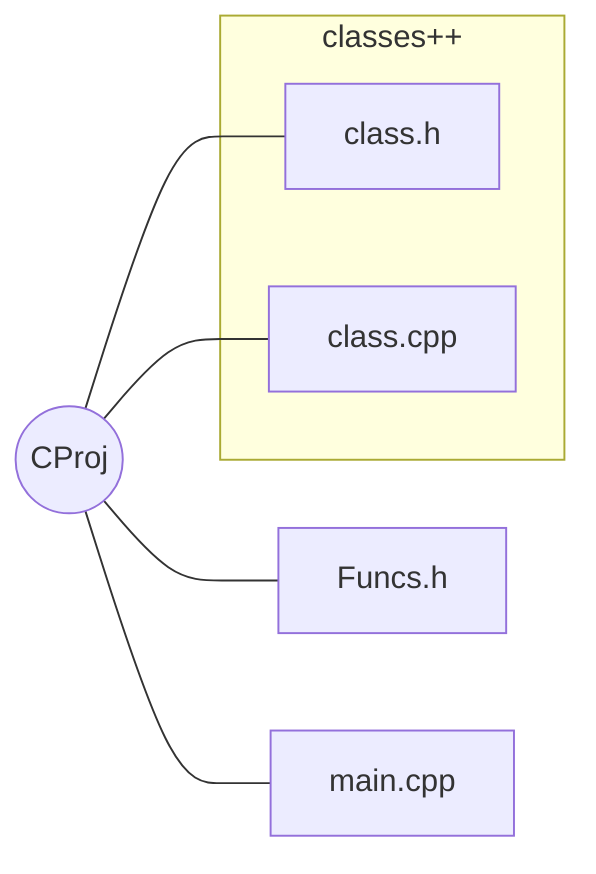
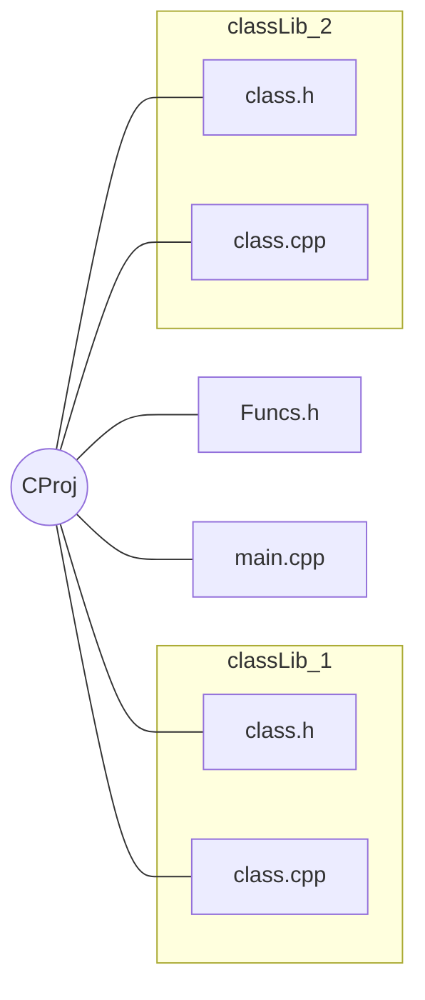

# SoftwareLearning

This repositories will place multiple self projects.

## Visual Studio

* **Funcs.h:** void class. For testing the code. Suppose to directly access object from classes.
* **main.cpp:** To call _funcs.h_

--->

